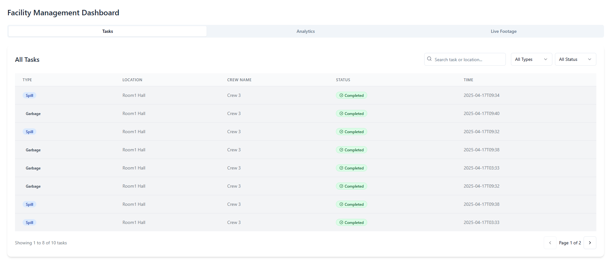
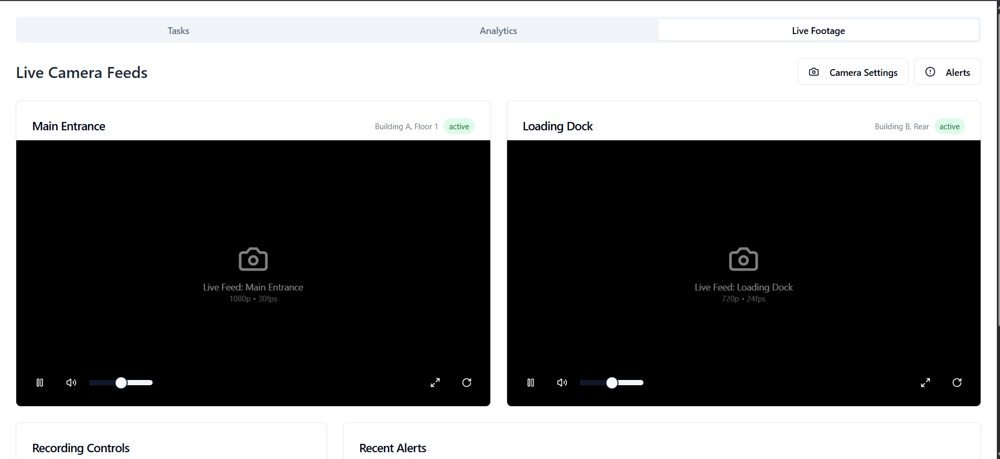
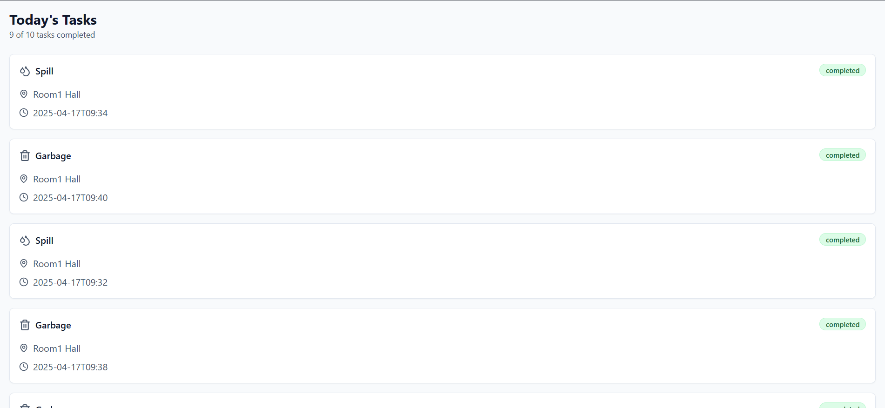

# Real-Time Spill Detection System Developed by Team Aura++


## Description

A real-time intelligent system that detects liquid spills and garbage using deep learning, 
notifies maintenance teams instantly through a connected dashboard and task management system.

Built for industrial and public safety, this solution ensures quick response and reduced hazard risk.

---

## Table of Contents

- [Features](#features)
- [Project Structure](#project-structure)
- [Setup Instructions](#setup-instructions)
  - [Prerequisites](#prerequisites)
  - [Installation](#installation)
- [Tech Stack](#tech-stack)
- [Testing](#testing)
- [Notes](#notes)
- [Demo](#demo)
- [Contributing](#contributing)
- [License](#license)

---

## Features

- **Real-time Detection** – Instantly identifies liquid spills and garbage using a custom-trained deep learning model
- **Admin Dashboard** – Centralized interface to monitor detections, alerts, and system activity in real-time
- **Crew Management** – Smart task assignment and tracking system for cleaning crew, ensuring timely resolution
- **Firebase Integration** – Secure authentication and real-time data synchronization using Firebase
- **Scalable Architecture** – Modular MERN stack integrated with Firebase for high performance and scalability

---

## UI Images :

### Admin Dashboard

---

---

### Crew Dashboard


## App UI


## Project Structure

```
Aura_plus_plus_hackgenx/
├── backend/               # Node.js + Express backend with ML integration
├── admin-dashboard/
├── crew-dashboard/        # Frontend interface for cleaning crew
├── model_training/        # Google Colab notebook for training
├── realtime-detection/    # Real-time detection via webcam(OPEN CV)/CCTV (Python)
└── README.md
```

---

## Setup Instructions

### Prerequisites (with Links)

- [Node.js](https://nodejs.org/)  
- [npm](https://www.npmjs.com/)  
- [Python 3.10](https://www.python.org/)  
- [Git](https://git-scm.com/)  
- [Firebase Console](https://console.firebase.google.com/)  
- [Google Colab](https://colab.research.google.com/)

### Installation

#### 1. Clone the Repository

```bash
git clone https://github.com/darshanbagade/Aura_plus_plus_hackgenx.git
cd Aura_plus_plus_hackgenx
```

#### 2. Train the Model Using Google Colab

- Open `model_training/spill_detection_colab.ipynb` in [Google Colab](https://colab.research.google.com/)
- Upload your spill dataset or link via Google Drive

Install dependencies:

```python
!pip install tensorflow keras opencv-python matplotlib
```

Train and save the model:

```python
model.save('spill_detection_model.h5')
```

- Download `spill_detection_model.h5` and place it in:  
  `backend/models/spill_detection_model.h5`

---

#### 4. Open ML Detection Model

Navigate to the backend:

```bash
cd realtime-detection
```

Install all dependencies
```bash
pip install opencv-python requests python-dotenv firebase-admin ultralytics
```

Run the Object Detection Model
```bash
python detection.py
```


Add your Firebase Admin SDK JSON to:

```
backend/config/firebaseServiceAccountKey.json
```

Start the backend server:

```bash
npm start
```

---

#### 4. Backend Setup

Navigate to the backend:

```bash
cd backend
npm install
```

Add your Firebase Admin SDK JSON to:

```
backend/config/firebaseServiceAccountKey.json
```

Start the backend server:

```bash
npm start
```

---

#### 5. Frontend Setup (Admin Dashboard)

Navigate to the frontend:

```bash
cd ../admin-dashboard
npm install
```

Update API base URL in `src/config.js`:

```javascript
export const API_BASE_URL = 'http://localhost:3000';
```

Run the frontend development server:

```bash
npm run dev
```

---

#### 5. Firebase Configuration

- Go to [Firebase Console](https://console.firebase.google.com/)
- Create a new project or use an existing one
- Enable Firestore Database and Firebase Authentication
- Download the Admin SDK credentials and place them in:

```
backend/config/firebaseServiceAccountKey.json
```

Firebase init code in `backend/index.js`:

```javascript
const admin = require('firebase-admin');
const serviceAccount = require('./config/firebaseServiceAccountKey.json');

admin.initializeApp({
  credential: admin.credential.cert(serviceAccount),
  databaseURL: 'https://<your-project-id>.firebaseio.com'
});
```

---

## Tech Stack

| Layer       | Technology               |
|-------------|---------------------------|
| Frontend    | React.js (JSX)           |
| Backend     | Node.js, Express.js      |
| ML Model    | Yolo, OpenCV      |
| Database    | Firebase Firestore       |
| Mobile App  | React Native,  Expo
| Auth        | Firebase Auth            |
| Training    | Google Colab             |

---

## Notes

- Use `.env` files to manage sensitive keys and secrets
- Place trained model in `backend/models/spill_detection_model.h5`
- Log model loading steps in backend for debugging